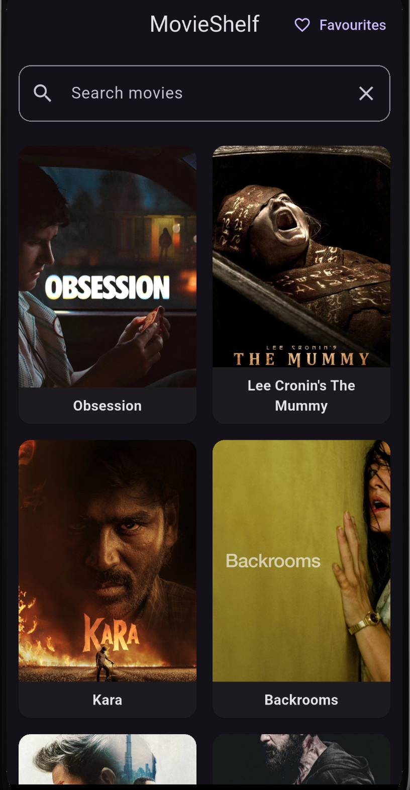
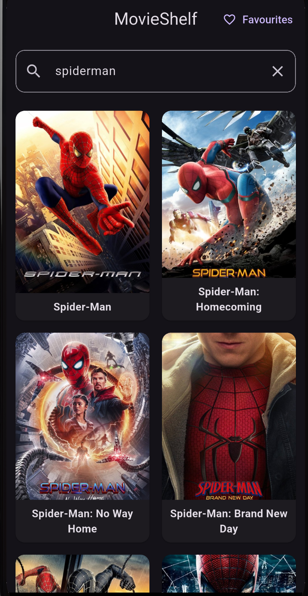
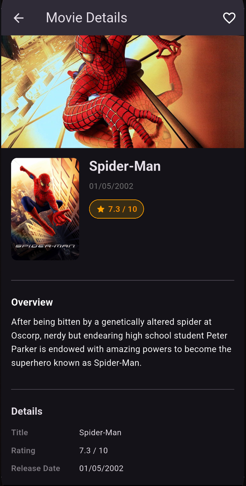
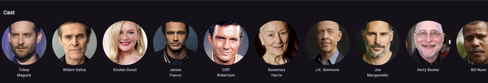
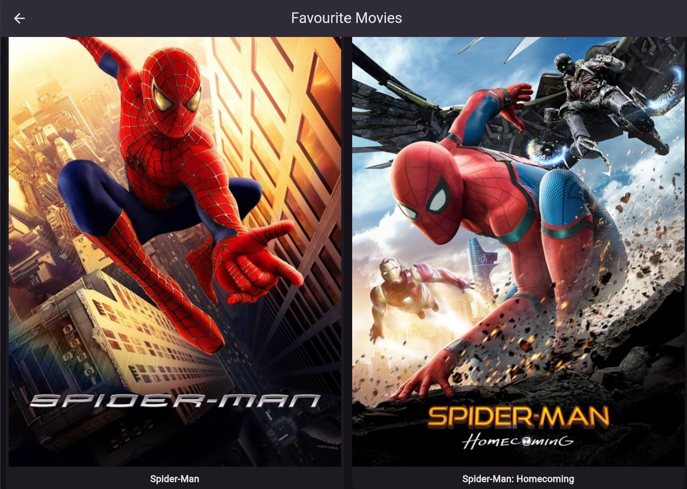
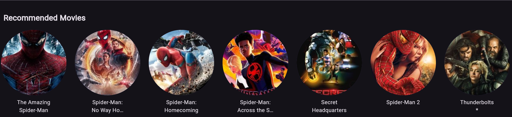

# 🎬 MovieShelf

MovieShelf is a Flutter application that allows users to discover movies, search for titles, view detailed information, explore cast members, get movie recommendations, and save favorite movies locally.

Built using Flutter, Riverpod, Hive, Dio, and TMDB API while following the Repository Pattern architecture.

---

## 📱 Features

### Home Screen
- Browse popular movies from TMDB
- Infinite scrolling pagination
- Grid-based movie layout

### Search Movies
- Search movies using TMDB Search API
- Real-time search results

### Movie Details
- Movie poster and backdrop
- Overview
- Rating
- Release date

### Cast Information
- View movie cast members
- Actor names and profile images

### Recommendations
- Get recommended movies based on the selected movie
- Horizontal scrolling recommendations section

### Favorites
- Add movies to favorites
- Remove movies from favorites
- Persistent local storage using Hive

---

## 🛠 Tech Stack

### State Management
- Riverpod

### Networking
- Dio
- TMDB API

### Local Storage
- Hive

### Architecture
- Repository Pattern
- Provider-based State Management
- Feature Separation

---

## 📂 Project Structure

lib/
├── models/
├── repositories/
├── providers/
├── screens/
├── widgets/
└── main.dart

## 📸 Screenshots

### Home Screen

### Search Movies

### Movie Details

### Cast Section

### Recommendations

### Favorites

## 🎯 What I Learned

- Flutter project structure
- Repository Pattern
- Riverpod State Management
- FutureProvider & AsyncNotifier
- API Integration with Dio
- Infinite Pagination
- Search APIs
- Local Storage with Hive
- Reusable Widgets
- Clean Architecture Principles
